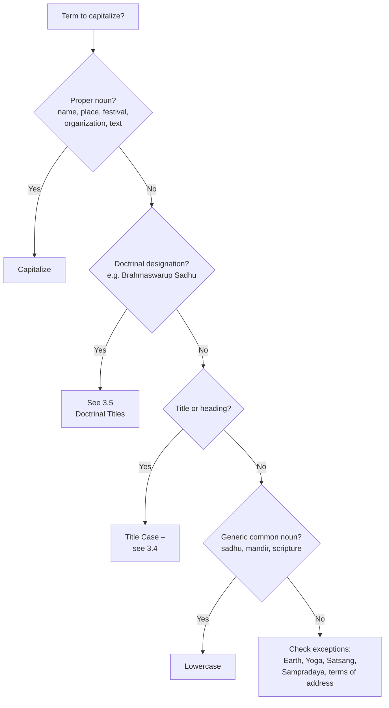

# 3.3 Capitalization

*Last reviewed by the SAP DTP team: 2026-05-13.*

Capitalization rules for SAP English publications.

## Quick Decision

Follow this for the common case. The rules below cover the full set of edge cases.

## 3.3.1 Core Rules
### 3.3.1.1 Indic Languages Don't Capitalize – Apply English Rules
Indic languages do not use capitalization. So follow **English capitalization rules** for transliterated text and titles to determine whether an Indic word or phrase needs to be capitalized.

### 3.3.1.2 Common Nouns
**Common nouns should not be capitalized** without specific reason.

- *darshan*, *arti*, *mandir*, *sadhu*, *guru*, *shastra* – all lowercase when used as ordinary common nouns.

### 3.3.1.3 Titles of Works
In titles, **capitalize all major terms**, but not:

- articles (a, an, the)
- prefixes
- coordinating conjunctions (and, but, or)
- prepositions

Use **italics** to indicate a book, newspaper, or periodical.

> *Bhagwan Swaminarayan: An Introduction to His Life and Work*

### 3.3.1.4 Diacritics in Titles and Headings
> Do **NOT** include diacritical marks in titles and headings.

This applies regardless of whether diacritics appear in the body text.

## 3.3.2 Practical Guidance
### 3.3.2.1 Always Capitalized
- **Personal names and titles when used as names:** Bhagwan Swaminarayan, Aksharbrahma Gunatitanand Swami, Pramukh Swami Maharaj, Mahant Swami Maharaj.
- **Place names:** Loj, Vartal, Gadhada, Sarangpur.
- **Names of texts:** Vachanamrut, Shikshapatri, Swamini Vato.
- **Names of organizations:** BAPS Swaminarayan Sanstha.
- **Festivals and holy days:** Janmashtami, Diwali, Annakut.
- **Tithis (named days of the lunar fortnight):** Padvo, Bij, Ekadashi, Punam, Amas. Roman, no italics, no diacritics – see [Tithis](../tithis/index.md) (Part 4) for the complete rule.

### 3.3.2.2 Lowercase
- **Generic terms:** *sadhu*, *temple*, *scripture*, *discourse*.
- **Generic religious actions:** *darshan*, *arti*, *katha*.
- **Generic descriptive adjectives:** *spiritual*, *philosophical*, *devotional*, *religious*, *traditional*, *ethical* — these don't derive from proper nouns and stay lowercase. (Proper adjectives like *Hindu*, *Vedic*, *Swaminarayan*, *Gandhian* are always capitalized — see [3.3.2.6](#3326-proper-adjectives-derived-from-names-places-religions-and-scriptures).)

### 3.3.2.3 *Earth* / *earth*
The capitalization depends on whether the reference is to the **planet by name** or to **soil, ground, the world, or the elemental matter**.

- **Earth** (capitalized) — proper-noun reference to the planet, alongside *Mars*, *Venus*, *Jupiter*: *life exists only on Earth*; *Earth revolves around the Sun*. *The Earth* and *Earth* are both acceptable for the planetary reference; the article-less form reads as more modern.
- **earth** (lowercase) — common-noun reference to soil, ground, land, the material element, or the world in a non-astronomical sense: *the seeds fell to the earth*; *fire, water, air, and earth*; *peace on earth*.

In theological and philosophical writing, lowercase is usually correct, since the reference is to the **earthly realm** or **material creation** rather than the planet by name: *attachment to earthly pleasures*; *the earth element*; *beings on earth*. Capitalize only when the planet itself is named: *all beings living on Earth*.

A useful test: 'Am I naming the planet?' Yes → *Earth*; no → *earth*.

### 3.3.2.4 Word Choice – *Cycle of Births and Deaths*
The preferred form is the singular-plural pair: ***cycle of births and deaths***.

- ✅ Most preferred: *cycle of births and deaths*
- ✓ Acceptable: *cycles of birth and death*
- Less preferred: *cycle of birth and death*

### 3.3.2.5 Adjective + Noun Phrases (*Brahmaswarup Sadhu*, *Akshar-Purushottam Darshan*)
How to capitalize compound phrases with a doctrinal adjective and a noun is governed by a separate four-rule system – see [Doctrinal Titles & Reverential Capitalization](doctrinal-titles.md).

### 3.3.2.6 Proper Adjectives Derived from Names, Places, Religions, and Scriptures
Adjectives derived from proper nouns are **capitalized**:

- **From places:** Indian philosophy, Gujarati literature, British English, Sanskrit grammar, European history.
- **From religions and traditions:** Hindu philosophy, Christian theology, Islamic jurisprudence, Swaminarayan theology, Vedantic interpretation.
- **From personal names:** Gandhian principles, Socratic dialogue, Platonic thought, Darwinian evolution.
- **From scriptures:** Veda → *Vedic* – Vedic philosophy, Vedic culture; Purana → *Puranic* – Puranic cosmology, Puranic narratives; Upanishad → *Upanishadic* – Upanishadic thought, Upanishadic teachings.

A useful test: if the adjective answers "*related to which specific person, place, religion, tradition, or text?*" it is a proper adjective and should be capitalized.

In a hyphenated compound, the proper-adjective element keeps its capital: *Hindu-majority population*, *Vedic-era literature*, *Sanskrit-based terminology*, *Gandhian-style reform*.

Common adjectives – *spiritual*, *devotional*, *philosophical*, *traditional*, *ethical* – remain lowercase.

!!! note "Doctrinal adjectives are different"
    Adjectives like *Brahmaswarup*, *Gunatit*, *Param Ekantik* aren't proper adjectives in the 3.3.2.6 sense – they're doctrinal qualifiers used in BAPS-specific reverential designations. They follow the rules in [3.5 Doctrinal Titles & Reverential Capitalization](doctrinal-titles.md), not this section.

### 3.3.2.7 *Yogic* vs. *Yoga*
- ***yogic*** – usually **lowercase** in modern English: *yogic discipline*, *yogic breathing*. The word has been lexicalized as a general adjective.
- ***Yoga*** – **capitalized** when it refers to the formal philosophical system: *Yoga philosophy*, *the Yoga Sutras*.
- **Named schools and forms of Yoga** – capitalize both elements as a formal designation: *Ashtanga Yoga*, *Hatha Yoga*, *Bhakti Yoga*, *Karma Yoga*, *Raja Yoga*.
- Some religious publishers capitalize *Yogic* for theological consistency. Either is defensible; consistency within a single publication matters most.

### 3.3.2.8 *Sampradaya*
- **Capitalize** as part of a formal name of a tradition: *Swaminarayan Sampradaya*, *Ramanuja Sampradaya*, *Vallabh Sampradaya*.
- **Lowercase** as a generic noun meaning "tradition" or "sect": *the sadhus of the old sampradaya*, *a young sampradaya*.

### 3.3.2.9 Historical Titles and Offices
Capitalize a formal title when it is tied to a specific person:

> Sundarji Suthar was the secretary to the **King of Kutch**.

Lowercase in generic reference:

> He hoped to become **king** of Kutch one day.

Same logic for *the Maharaja of Bhavnagar*, *the Diwan of Junagadh*, etc.

### 3.3.2.10 The Definite Article with Unique Theological Designations
English requires the definite article *the* before a unique title or singular theological identity:

- *the Supreme God*
- *the Supreme Lord*
- *the Supreme Being*
- *the Almighty*

Capitalize *Supreme* / *Almighty* when functioning as part of the formal designation. Use lowercase when *supreme* is genuinely descriptive:

- ✅ *Sahajanand Swami himself is the manifestation of the **Supreme God**.*
- ✅ *An atheist does not believe in the existence of an eternal, **supreme** God.*
- ✅ *Damodarbhai believed Shriji Maharaj was the **Supreme God** – Purna Purushottam Narayan.*

This same rule resolves *Sarvopari* / *sarvopari*: cap when it forms part of a formal designation (*Sarvopari Bhagwan Swaminarayan*); italic lowercase when it's a quality descriptor.

### 3.3.2.11 *Satsang* as a Doctrinal Term
- ***Satsang*** – capitalized, roman, when it refers to the BAPS Swaminarayan tradition or institution as a doctrinal designation:

  > The glory of **Satsang** is infinite.

- ***satsang*** – lowercase, italic, in generic descriptive usage (a gathering, the practice of keeping holy company): *a satsang gathering*, *attended satsang*.

### 3.3.2.12 Title Case for Headings on This Site
We use **title case** for headings on this site, our digital publications, and book and chapter titles in print: capitalize the first and last words and all major terms; lowercase articles, coordinating conjunctions, prepositions of any length, and the infinitive *to*. The full title-case rules — including hyphenated words, the first word after a colon, phrasal verbs, and other edge cases — live in [3.4 Title Case in Detail](title-case.md).

### 3.3.2.13 Terms of Address (Direct Address and Family Relationships)
Capitalize a title or term of address when it **stands in for a name** – when you could substitute the person's actual name in the same slot:

- Direct address: *That's an order, **Sergeant**.* / *I'll get right on it, **Chief**.* / *I object, **Your Honour**.*
- Family used as a name: *If only **Father** were here.* / *I'll tell **Mom**!*

Lowercase when the title or relationship term is preceded by a possessive or article – it's now a common noun describing a role:

- *the sergeant gave the order*
- *Wait until your **father** gets home.*
- *I saw your **mom** yesterday.*

Common terms of respect – *sir*, *ma'am*, *miss* – stay lowercase even in direct address. (Exception: in salutations of letters and emails: *Dear Sir*.) Terms of endearment are also lowercase: *I'll get it, dear.*

### 3.3.2.14 Ages and Time Periods
**Capitalize** when the period has an established proper-noun-like name:

- the Bronze Age, the Iron Age
- the Middle Ages, the Renaissance, the Reformation
- the Jazz Age, the Roaring Twenties
- the Vedic Period, the Maurya Era
- the Hindu *yugas* — *Satyuga*, *Tretayuga*, *Dvaparayuga*, *Kaliyuga* — capitalized as proper-noun cosmic ages

**Lowercase** when the description is generic or merely descriptive:

- ancient Greece, classical Rome
- the colonial period, the antebellum period
- the post-war years, the medieval period (when used loosely)

### 3.3.2.15 Adjectives before Capitalized Nouns – General Rule
A descriptive adjective is **not** capitalized just because the noun it modifies is capitalized:

- ✅ a **delicious** Italian meal (*Italian* is a proper adjective; *delicious* is descriptive)
- ✅ the **tall** Eiffel Tower
- ✅ a **colourful** Diwali celebration

**Exception:** capitalize the adjective when it is part of an established proper noun, formal title, or recognized epithet:

- the **Atlantic** Ocean
- the **United** States
- the **Rocky** Mountains
- the **Supreme** Court
- the **Holy** Bible
- the **Big Apple** (epithet for New York)
- **Alexander** the **Great**

For BAPS-specific doctrinal designations (*Sarvopari Bhagwan Swaminarayan*, *Param Ekantik Sadhu*, *Brahmaswarup Sadhu*, *Gunatit Guru*), see [Doctrinal Titles](doctrinal-titles.md).

### 3.3.2.16 Definitions Use Sentence Case (Not Title Case)
The term being defined uses title case (or whatever its standard form is); the definition itself uses **sentence case** – first word and proper nouns only. This applies to glossary entries, term-and-meaning tables, and any definition-style construction.

| Term (title case) | Definition (sentence case) |
|---|---|
| **Param Bhagvat** | Ideal devotee of God, referring to the Satpurush. |
| **Param Bhagvat Sant** | Ideal sadhu of God, referring to the Satpurush. |
| **Param Ekantik Sant** | Ideal *ekantik* sadhu of God, referring to the Satpurush. |

❌ Don't write the definition in title case (*'Ideal Devotee Of God, Referring To The Satpurush.'*) and don't lowercase proper nouns within it (*'ideal sadhu of god, referring to the satpurush'*).

## 3.3.3 Open Questions
The capitalization of several specific terms is still under team discussion. The full list lives in [Open Discussions](../discussions/index.md). Highlights:

- **Sanstha names** – Sanstha / sanstha; BAPS Sanstha vs the Sanstha. See [Sanstha & Mandirs](../discussions/sanstha-and-mandirs.md).
- **Mandir names** – *Sarangpur Mandir* / *Sarangpur mandir* / *the BAPS mandir in Sarangpur*. See [Sanstha & Mandirs](../discussions/sanstha-and-mandirs.md).
- **Honorifics** – *Bhagwan* / *bhagwan*; *Shri* / *shri*. See [Gurus & Honorifics](../discussions/gurus-and-honorifics.md).
- **Philosophical terms** – *Advaita* / *advaita*; *Darshan* / *darshan*. See [Transliteration](../discussions/transliteration.md).

## 3.3.4 See Also
- [3.4 Title Case in Detail](title-case.md) – the full title-case rules, separated from this page for navigability.
- [3.5 Doctrinal Titles & Reverential Capitalization](doctrinal-titles.md) – the four-rule system for BAPS-specific reverential designations.
- [3.6 Italics](italics.md) – what to italicize (capitalization and italicization are independent decisions).
- [Translation rules](../translation/translation-rules.md) – capitalizing names of prominent figures.
- [Diacritics & Transliteration](../diacritics/index.md) – the rule that diacritics never appear in titles or headings.
