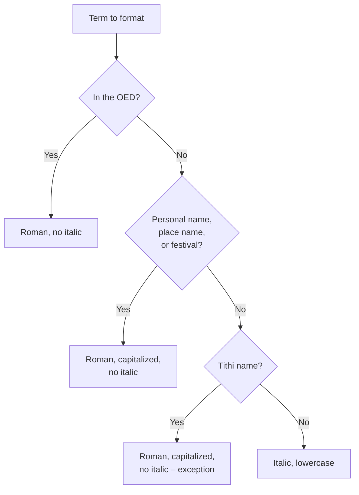

# 3.6 Italics

*Last reviewed by the SAP DTP team: 2026-05-13.*

How we set italics for non-English terms in SAP English publications.

For when to translate vs transliterate vs anglicize, see [Translation Rules](../translation/translation-rules.md).

## Quick Decision

Follow this for the common case. The rules below cover edge cases (multiword phrases, titles of works, English emphasis, verses).

??? example "Show me — multiple italics decisions in one paragraph"

    > Bhagwan Swaminarayan visited Sarangpur Mandir during Janmashtami and addressed the assembly. The discourse drew from the *Vachanamrut* and the *Shikshapatri*, and turned to the practice of *mansi puja*. Devotees performed *dandvats* and received *prasad*. The discourse ended with the blessing *Patthar satsang karavshe* — 'the stones will spread the glory of satsang'.

    - *Bhagwan Swaminarayan*, *Sarangpur Mandir*, *Janmashtami* — names, place names, and festivals: **roman, capitalized, no italic** ([3.6.1.2](#3612-names-and-capitalized-proper-nouns-not-italicized)).
    - *Vachanamrut*, *Shikshapatri* — titles of works: **italic** ([3.6.1.4](#3614-titles-short-stories-poems-art)).
    - *mansi puja* — multiword Indic phrase, whole phrase italicized as a unit ([3.6.1.5](#3615-multiword-sanskrit-and-indic-phrases-italicize-the-whole-phrase)).
    - *dandvats* — Indic term not in the OED: **italic, lowercase** ([3.6.1.1](#3611-indic-words-and-phrases-not-anglicized)). Note the plural takes an italic *s* — see [Plurals §3.7.1.1](plurals.md#3711-plurals-of-transliterated-indic-words).
    - *prasad* — in the OED: **roman, no italic** ([3.6.1.3](#3613-anglicized-terms-not-italicized)).
    - *Patthar satsang karavshe* — quoted Gujarati phrase: italic; the English gloss in single quotes is roman ([3.9.1.4](quotation-marks.md#3914-mottoes-and-slogans-presented-as-phrases-single-quotes)).

## 3.6.1 The Rules
### 3.6.1.1 Indic Words and Phrases (Not Anglicized)
Indic words and phrases that are **not anglicized** – i.e. not found in the OED – are **italicized** in:

- the main text
- photo captions and other legends
- footnotes

These italicized words can be collated to form a glossary at the end of the book.

> The aspirant performed *dandvats* before the *murti* of Bhagwan Swaminarayan.

### 3.6.1.2 Names and Capitalized Proper Nouns – Not Italicized
The following are set in **roman alphabet with initial caps** – **do not italicize** them:

- Personal names
- Place names
- Peoples and tribes
- Institutions and organizations
- Holy days
- Festivals
- Titles of persons (when used with the name)
- **Tithis** (named days of the lunar fortnight) – see [Tithis](../tithis/index.md) for the full rule

> Pramukh Swami Maharaj visited Sarangpur Mandir during Janmashtami.

!!! note "Exception – tithis are roman even though they are not in the OED"
    Tithi names (*Padvo*, *Bij*, *Ekadashi*, *Punam*…) would normally be italicized under the rule in 3.6.1.1, since they are not anglicized. They are an explicit exception: they function as **named days** (like *Tuesday* or *Diwali*), so they are set roman with caps. The fortnight designators ***sud*** and ***vad***, however, remain *italic, lowercase*. See [Tithis](../tithis/index.md) (Part 4).

### 3.6.1.3 Anglicized Terms – Not Italicized
Indic terms that have become **anglicized** are in **roman, lowercase**.

> The discourse drew from the Vedas and turned to the nature of dharma.

!!! note "Exception – italicized anglicized terms"
    Italics may sometimes be used for unfamiliar words **or if the OED definition does not fully correlate to the intended meaning**. The (partial) list of anglicized words in the OED identifies words which SAP prefers to italicize. Such words are included in that publication's glossary.

### 3.6.1.4 Titles, Short Stories, Poems, Art
**Do not italicize** Indic words in:

- Titles of works of art
- Short stories
- Poems

### 3.6.1.5 Multiword Sanskrit and Indic Phrases – Italicize the Whole Phrase
If any essential part of a multiword phrase is non-naturalized, italicize the **entire** phrase as a single foreign lexical unit. Splitting italicization across the phrase implies the parts are independent words rather than a unified concept.

- ✅ *murti puja*
- ✅ *ekantik dharma*
- ✅ *mansi puja*
- ✅ *nitya karma*
- ✅ *vanaprasth ashram*
- ✅ *guru parampara*
- ❌ murti *puja*  /  *murti* puja
- ❌ *ekantik* dharma  /  ekantik *dharma*

The phrase functions as a single doctrinal concept, named practice, or technical expression – typography reflects that semantic unity.

This rule applies to descriptive multiword phrases. Phrases that are formal doctrinal designations (e.g. *Akshar-Purushottam Darshan*, *Gunatit Guru Parampara*) follow the [Doctrinal Titles & Reverential Capitalization](doctrinal-titles.md) rules and are roman.

## 3.6.2 Punctuation Adjacent to Italicized Phrases
The default rule: punctuation appears in the same font as the **surrounding text**, not the italicized word or phrase. So a comma, period, question mark, or other mark following an italicized word in roman prose stays roman.

- *kem chho*? – the question mark stays roman.
- *Bhagwan bhaji leva*. – the period stays roman.
- He cited the *Vachanamrut*, the *Shikshapatri*, and the *Swamini Vato* – the commas stay roman.

### Exception – Punctuation that Belongs to the Italicized Title
When a question mark, exclamation point, or other terminal punctuation is **part of an italicized title or work**, italicize the punctuation along with it:

- Have you seen the play *Who's Afraid of Virginia Woolf?* – the question mark is part of the title and stays italic.
- The novel *Are You There God? It's Me, Margaret* has a question mark mid-title – both that mark and the comma after *God?* are part of the italicised title.
- The biographical study *Bhagwan Swaminarayan: An Introduction to His Life and Work* takes the colon as part of the italicised title – the colon italicises along with the rest.

If an italicized title's terminal punctuation conflicts with the surrounding sentence's needs (e.g. would produce a doubled question mark), recast the sentence:

- ❌ Have you seen *Who's Afraid of Virginia Woolf?*?
- ✅ Are you familiar with the play *Who's Afraid of Virginia Woolf?*

Quotation marks adjacent to italicized words stay roman – they belong to the surrounding sentence, not the word inside.

## 3.6.3 Italics for English Emphasis
Italics may be used to emphasize a word or short phrase in English prose – but **sparingly**. Overuse drains the device of any effect.

> The point is not *what* he said, but *how* he said it.

Reserve emphasis-italics for genuine contrast or stress that the sentence rhythm cannot otherwise convey. Avoid them as a substitute for forceful diction.

## 3.6.4 Shlokas, Padas, and Other Quoted Verses
When quoting a transliterated Sanskrit, Gujarati, or Hindi verse – a *shloka*, *pada*, *bhajan* line, or scripture quotation – alongside its English translation:

- The **transliterated verse** is set in *italics*.
- The **English translation** is set in roman.
- Both follow English-language punctuation.
- Diacritics in the verse text are **permitted** (and preferred where pronunciation matters). The **BAPS in-house default** is the [Macron-Only Convention](../diacritics/macron-convention.md) – long *a* marked with a macron, no other diacritics. A different system (full IAST, etc.) is a project-level decision; see [SAP Diacritics Policy](../diacritics/sap-policy.md). The **prose text** around the verse stays plain-Roman per [§5.2](../diacritics/sap-policy.md). For each transliterated term, the macron-only spelling is recorded in the [glossary's](../diacritics/glossary-reference.md) `diacriticSpelling` column.

> *māgha-māsi sitā-pakṣe pratipadī…*
> 
> "On the first day of the waxing fortnight of the month of Maha…"

If the verse is unfamiliar to the readership, italicize the first appearance of the transliteration; in subsequent appearances within the same publication, the gloss can be dropped. (Same logic as a single Indic term – see *Indic words and phrases* above.)

## 3.6.5 Decision Summary
| Word | Form | Italics? |
|---|---|---|
| Anglicized (in OED) | dharma, dal, puri | No |
| Personal/place name | Bhagwan Swaminarayan, Sarangpur | No |
| Festival, holy day | Janmashtami, Diwali | No |
| Tithi (named lunar day) | Padvo, Ekadashi, Punam | No (exception – see [Tithis](../tithis/index.md)) |
| Fortnight designator | *sud*, *vad* | Yes (italic, lowercase) |
| Other Indic term in prose | *dandvat*, *kothari*, *patshala* | Yes |
| Title of a poem/short story | 'Akshar Anubhuti' | No |

This table answers "italicize this term?" – not "how do I form its plural?". Pluralization (native plural vs *-s* on the italic word vs OED form) is a separate decision; see [Plurals §3.7](plurals.md).

## 3.6.6 See Also
- [Plurals](plurals.md) – how the plural endings work for italicized vs anglicized terms.
- [Quotation marks](quotation-marks.md) – how to present a transliteration alongside its translation.
- [Diacritics & Transliteration](../diacritics/index.md) – what spellings to use for the italicized terms.
